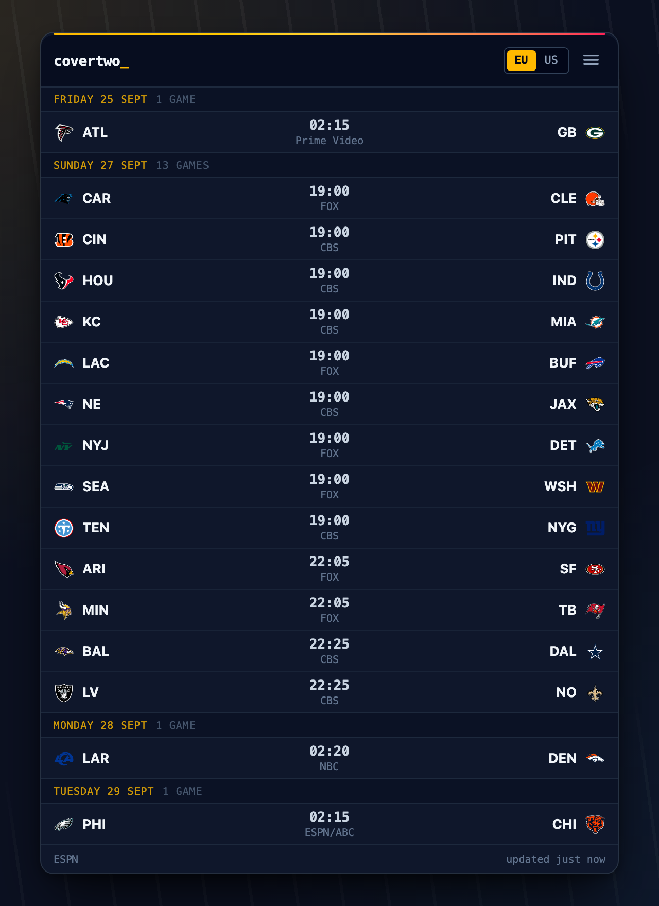
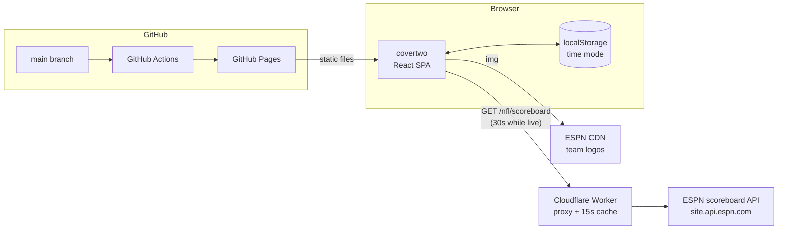
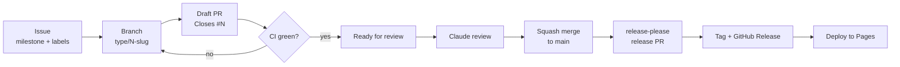
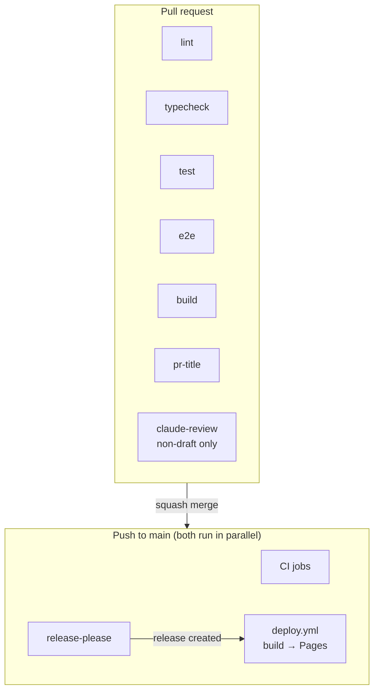

# covertwo

[](https://github.com/moudlajs/covertwo/actions/workflows/ci.yml)
[](https://github.com/moudlajs/covertwo/releases)
[](https://github.com/moudlajs/covertwo/deployments/github-pages)
[](LICENSE)

A small, modest NFL live scoreboard. One compact row per game, grouped by
day, with a Europe/US time toggle. A widget, not a website.

**Live:** https://moudlajs.github.io/covertwo/



## Architecture

A static site on GitHub Pages plus one tiny Cloudflare Worker. ESPN's API
rejects browser requests from other sites, so the Worker fetches it
server-side, caches it for ~15s and adds CORS headers.



## Development workflow

Every change is an issue, a branch, and a draft PR. The PR title becomes the
squash commit, which release-please turns into a version and changelog.



## CI/CD pipeline



All seven PR checks are required by the `main` ruleset. e2e runs Playwright
against a local ESPN fixture; CI never calls the real API.

## Local development

Requires Node 22+.

```sh
npm ci
npm run dev          # http://localhost:5173/covertwo/
```

## Testing

```sh
npm run lint         # ESLint + Prettier
npm run typecheck
npm test             # Vitest + React Testing Library
npx playwright install chromium   # once
npm run e2e          # Playwright, mobile + desktop, mocked ESPN
npm run build
```

## Releasing

Releases are automated. Merging `feat:` / `fix:` PRs makes release-please
open (or update) a release PR; merging that tags `vX.Y.Z`, publishes a GitHub
Release, and deploys to Pages. Versions come from the PR titles only:
`feat` bumps the minor version, `fix` the patch. Milestones are for planning
and don't set versions; the one manual override is `Release-As: 1.0.0` when
the MVP (M1) ships.

To redeploy without a release, run the **Deploy** workflow manually.

## Roadmap

See the [milestones](https://github.com/moudlajs/covertwo/milestones).
Contributing rules are in [CONTRIBUTING.md](CONTRIBUTING.md).

## License

[MIT](LICENSE)
