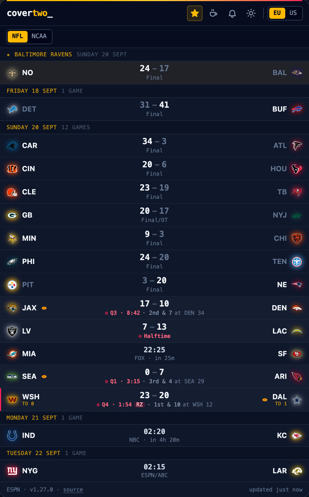
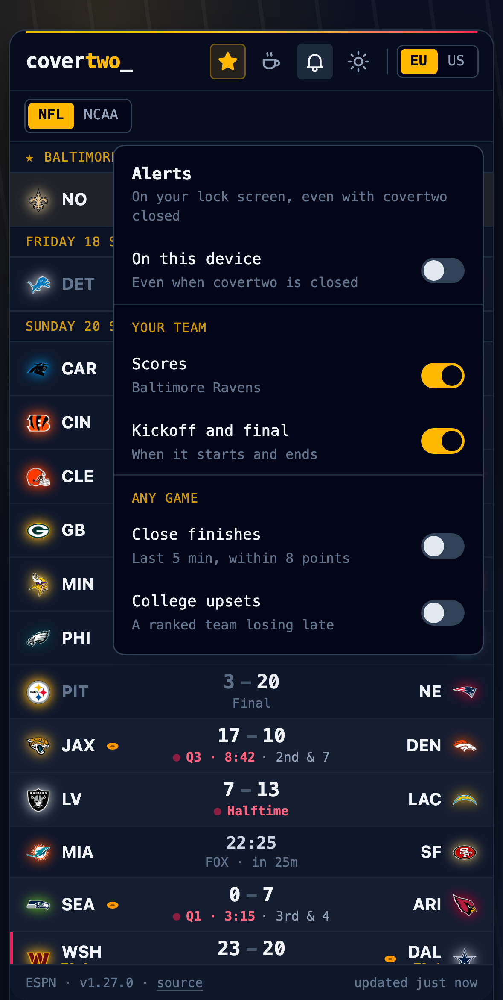
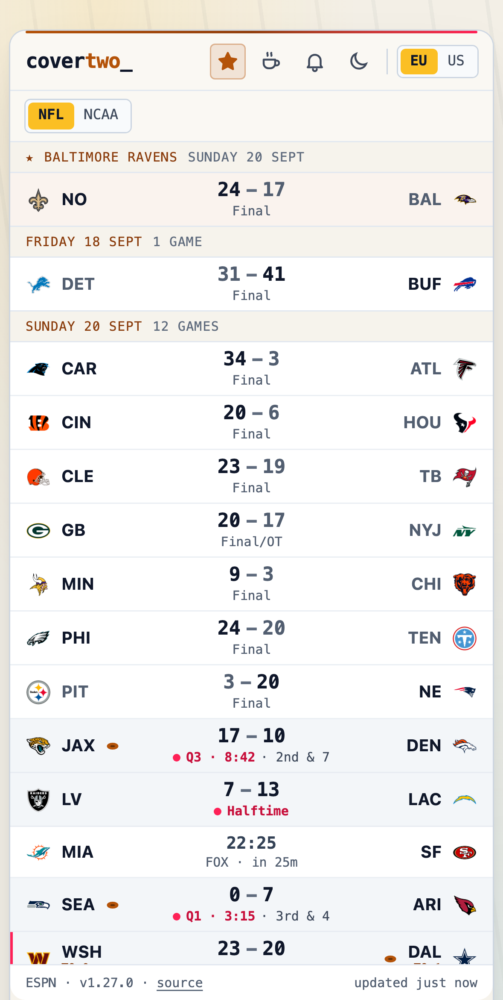
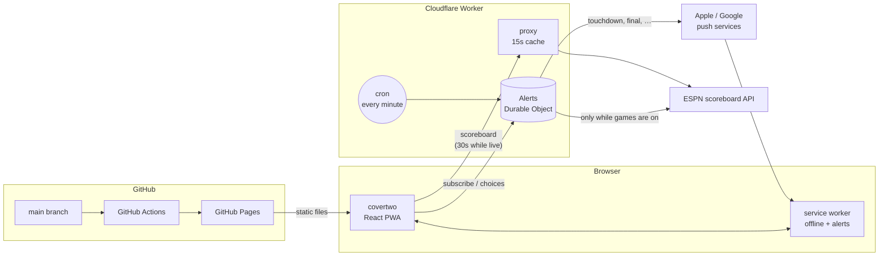
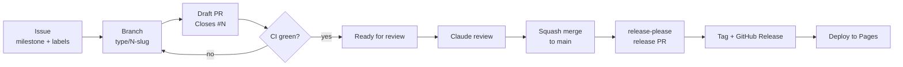
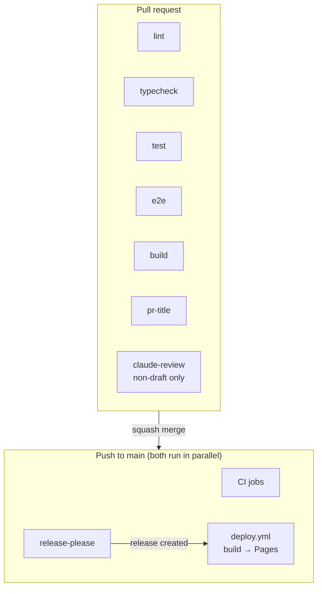

# covertwo

[](https://github.com/moudlajs/covertwo/actions/workflows/ci.yml)
[](https://github.com/moudlajs/covertwo/releases)
[](https://github.com/moudlajs/covertwo/deployments/github-pages)
[](LICENSE)

A calm NFL and college football scoreboard. One compact row per game,
grouped by day, in European or US time. No ads, no account, no video: just
the scores, a widget rather than a website.

**Live:** https://moudlajs.github.io/covertwo/ (or [`?demo`](https://moudlajs.github.io/covertwo/?demo) for a Sunday frozen mid-game)



<p>
  
  
</p>

## What it does

- **NFL and college**: college as the Top 25 or all FBS games; any week of the
  season, including the playoff rounds before their matchups are set.
- **Live detail, kept calm**: the score, clock, down and distance, red zone and
  possession in the row; tap a game for quarters, leaders and the last play.
- **Your team** (★) pinned to the top and highlighted; every team's logo glows
  in its own colours.
- **Lock-screen alerts** (🔔), even with covertwo closed: your team's scores,
  kickoff and final, close finishes, college upsets. Each one is optional.
- **An app on your phone**: add it to the home screen for the full-screen app,
  keep the screen on (☕) while it's open, and see the last scores offline.
- **Light and dark** themes (☀), EU or US time.

## Architecture

A static site on GitHub Pages plus one small Cloudflare Worker on the free
plan. ESPN's API rejects browser requests from other sites, so the Worker
fetches it server-side, caches it for ~15s (every visitor shares one upstream
request) and adds CORS headers. The same Worker runs the lock-screen alerts:
a cron every minute has one Durable Object look at the games that matter, spot
touchdowns, finals and close finishes, and send them through the phones' push
services.


```mermaid
flowchart LR
  subgraph Browser
    App[covertwo<br/>React PWA]
    SW[service worker<br/>offline + alerts]
  end
  subgraph Worker[Cloudflare Worker]
    Proxy[proxy<br/>15s cache]
    Alerts[(Alerts<br/>Durable Object)]
    Cron((cron<br/>every minute))
  end
  ESPN[ESPN scoreboard API]
  Push[Apple / Google<br/>push services]
  subgraph GitHub
    Repo[main branch] --> Actions[GitHub Actions] --> Pages[GitHub Pages]
  end
  Pages -- static files --> App
  App -- "scoreboard<br/>(30s while live)" --> Proxy --> ESPN
  App -- "subscribe / choices" --> Alerts
  Cron --> Alerts -- "only while games are on" --> ESPN
  Alerts -- "touchdown, final, …" --> Push --> SW
  App <--> SW
```

## Development workflow

Every change is an issue, a branch, and a draft PR. The PR title becomes the
squash commit, which release-please turns into a version and changelog.


```mermaid
flowchart LR
  Issue[Issue<br/>milestone + labels] --> Branch["Branch<br/>type/N-slug"]
  Branch --> Draft[Draft PR<br/>Closes #N]
  Draft --> CI{CI green?}
  CI -- no --> Branch
  CI -- yes --> Ready[Ready for review]
  Ready --> Review[Claude review]
  Review --> Merge[Squash merge<br/>to main]
  Merge --> RP[release-please<br/>release PR]
  RP --> Tag[Tag + GitHub Release]
  Tag --> Deploy[Deploy to Pages]
```

## CI/CD pipeline


```mermaid
flowchart TB
  subgraph PR["Pull request"]
    direction LR
    lint & typecheck & test & e2e & build
    title[pr-title]
    claude[claude-review<br/>non-draft only]
  end
  subgraph Main["Push to main (both run in parallel)"]
    direction LR
    ci2[CI jobs]
    rp[release-please] -- release created --> deploy[deploy.yml<br/>build → Pages]
  end
  PR -- squash merge --> Main
```

All seven PR checks are required by the `main` ruleset. e2e runs Playwright
against a local ESPN fixture; CI never calls the real API.

## Local development

Requires Node 22+.

```sh
npm ci
npm run dev          # http://localhost:5173/covertwo/
```

## Testing

```sh
npm run lint         # ESLint + Prettier
npm run typecheck
npm test             # Vitest + React Testing Library
npx playwright install chromium   # once
npm run e2e          # Playwright, mobile + desktop, mocked ESPN
npm run build
```

## Releasing

Releases are automated. Merging `feat:` / `fix:` PRs makes release-please
open (or update) a release PR; merging that tags `vX.Y.Z`, publishes a GitHub
Release, and deploys to Pages. Versions come from the PR titles only:
`feat` bumps the minor version, `fix` the patch. Milestones are for planning
and don't set versions; the one manual override is `Release-As: 1.0.0` when
the MVP (M1) ships.

To redeploy without a release, run the **Deploy** workflow manually.

## Roadmap

See the [milestones](https://github.com/moudlajs/covertwo/milestones).
Contributing rules are in [CONTRIBUTING.md](CONTRIBUTING.md).

## Not affiliated

covertwo is a hobby project, not affiliated with the NFL, the NCAA, ESPN or
any team. Scores come from ESPN's public scoreboard; team names and logos
belong to their owners.

## License

[MIT](LICENSE)
