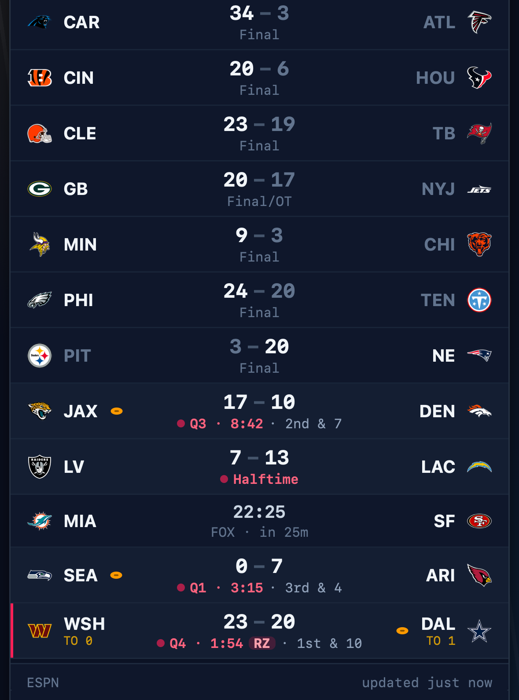
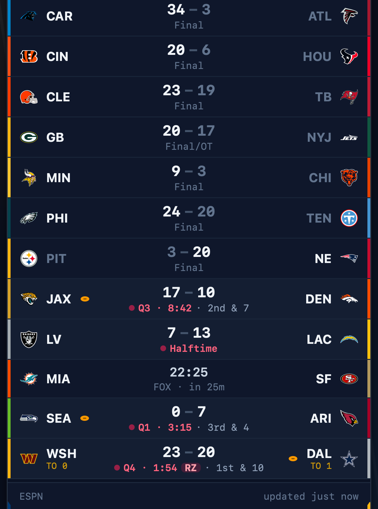
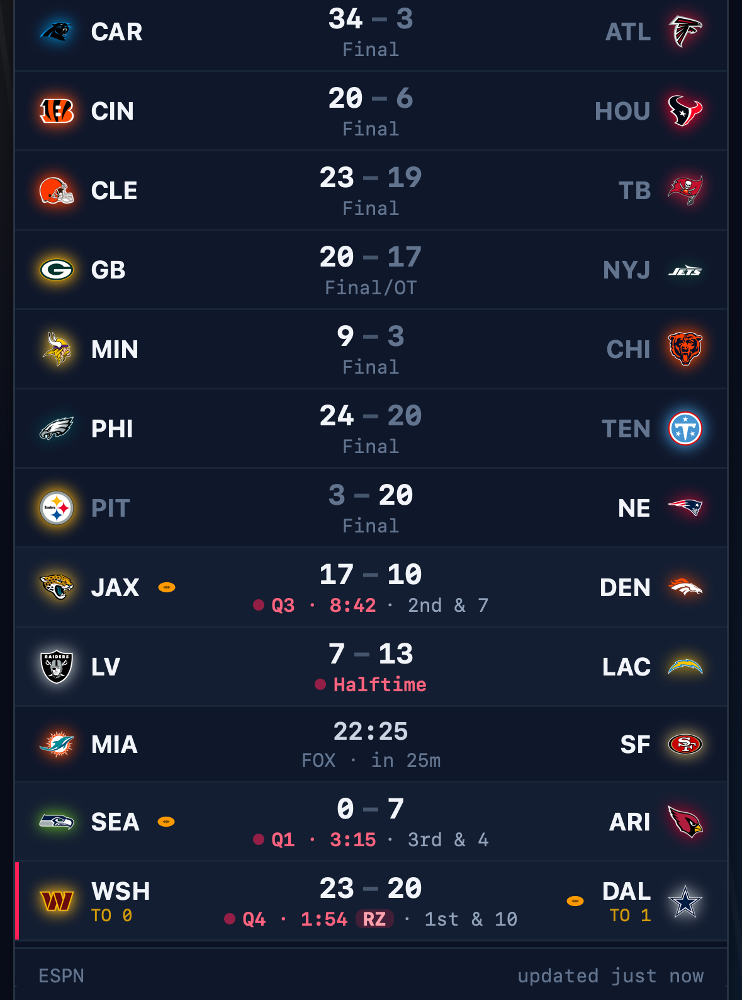
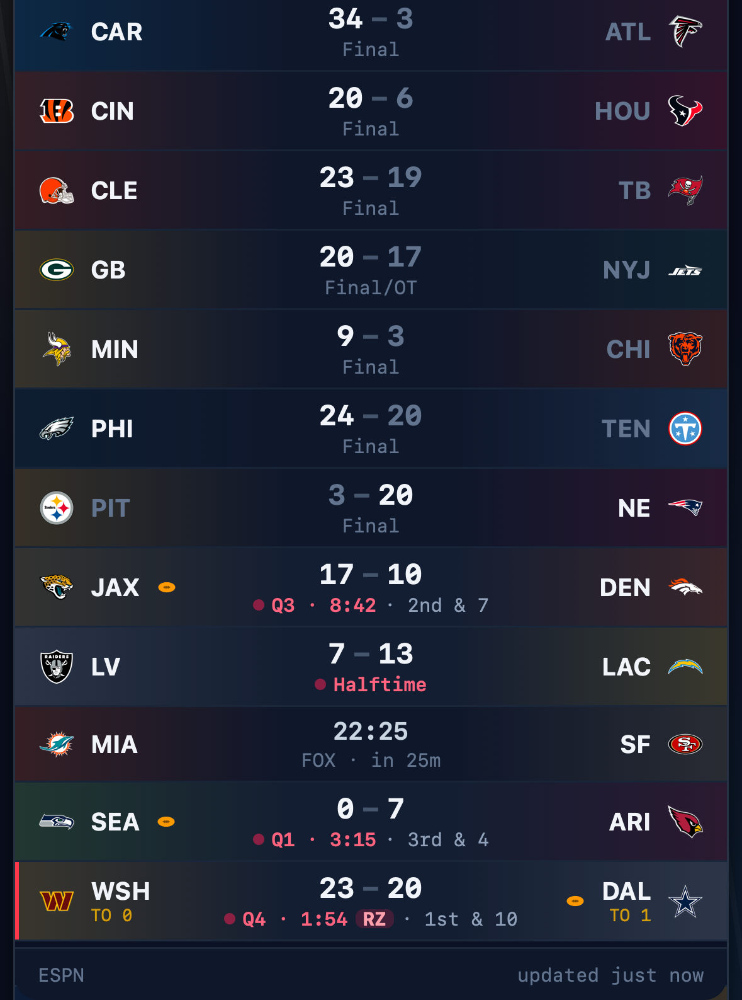

# Team colours: design alternatives

Decided 2026-09-25 (#47): **B, logo glow** is implemented. The other variants
are kept here in case the glow ever feels wrong. All screenshots come from the
real app (`?demo`, iPhone 15, WebKit), with each team's colour chosen by
`teamColor()`: the brighter of ESPN's primary and alternate that isn't
near-white glare.

**Why B:** row backgrounds already carry meaning (lighter = live, amber =
your team, red edge = red zone). B only touches the logos, so it never
competes with those signals, and it works on a light theme too.

| Current (before)               | A · edge bars            | B · logo glow ✓          | C · name underline       | D · split tint           |
| ------------------------------ | ------------------------ | ------------------------ | ------------------------ | ------------------------ |
|  |  |  |  |  |

- **A · edge bars:** a 3px team-colour bar at each side's outer edge.
  Colourful, but frames every row like a stadium board, and takes over the red
  edge that means "red zone".
- **B · logo glow (implemented):** a soft `drop-shadow` halo in the team
  colour behind each logo. Subtle, calm, and also helps dark logos.
- **C · name underline:** a team-colour underline under each abbreviation.
  Barely visible at this size. (In the screenshot it's clipped by the
  abbreviation's `truncate`; a real version would need `overflow: visible`.)
- **D · split tint:** a faint wash of each team's colour from its side of the
  row. Nice atmosphere, but 14 tinted rows get busy, and it collides with the
  live and favourite row tints.

Switching later: `TeamLogo`'s `glow` prop is the only place B lives; `Team.color`
is available to any other variant.
